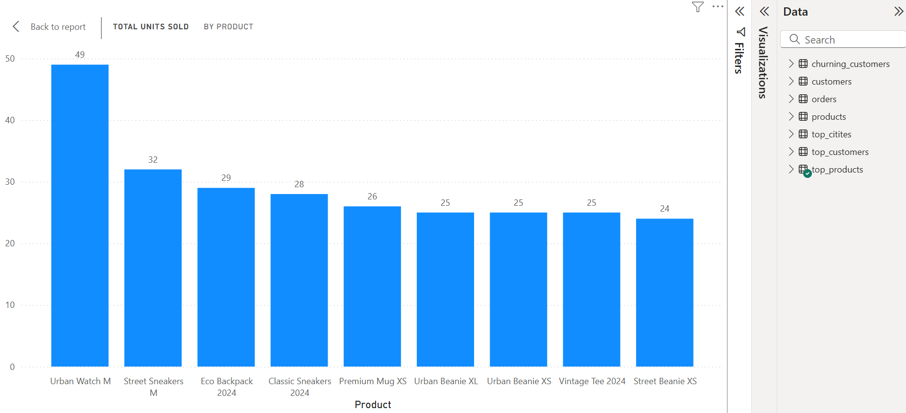
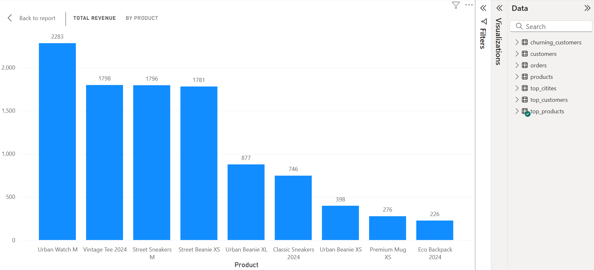
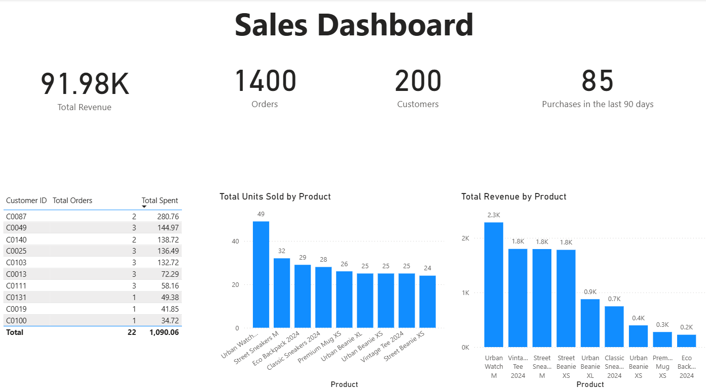

# Introduction
I have analysed a fictitious sales dataset using SQL and Power BI

### Tools used
- PostgreSQL
- VSCode
- Power BI Desktop

### Key Questions
1) What are the top selling products?
2) What are the top selling cities?
3) Who are our most loyal customers?
4) Who are our churning customers?
5) What is the total revenue, total orders, total customers, total purchases made in the past 90 days?


### My Analysis
1) What are the top selling products?
  ```
SELECT 
  products.product_name product,
  orders.product_id,
  SUM(quantity) total_units,
  SUM(total_gbp) revenue
FROM orders
JOIN products on orders.product_id = products.product_id 
GROUP BY orders.product_id, products.product_name
ORDER BY total_units DESC, revenue DESC
LIMIT 10
```
 
 
1) What are the top selling cities?
```
SELECT 
 city,
 SUM(total_gbp) city_revenue
FROM orders
JOIN customers ON orders.customer_id = customers.customer_id
GROUP BY city
ORDER BY  city_revenue DESC
LIMIT 5
```
1) Who are our most loyal customers?
```
SELECT 
orders.customer_id,
email,
COUNT(orders.customer_id) total_orders,
SUM(total_gbp) customer_revenue
FROM orders
JOIN customers ON orders.customer_id = customers.customer_id
GROUP BY orders.customer_id, email
HAVING COUNT(orders.customer_id)  > 10
ORDER BY total_orders DESC, customer_revenue DESC
LIMIT 10
```
1) Who are our churning customers?
```
SELECT 
orders.customer_id,
email,
COUNT(orders.customer_id) total_orders,
SUM(total_gbp) customer_revenue
FROM orders
JOIN customers ON orders.customer_id = customers.customer_id
GROUP BY orders.customer_id, email
HAVING COUNT(orders.customer_id)  < 5
ORDER BY total_orders ASC, customer_revenue ASC
LIMIT 10
```
1)  What is the total revenue, total orders, total customers, total purchases made in the past 90 days?
91.8k Total revenue, 1400 orders, 200 customers and 85 purchases made in the past 90 days.
   
